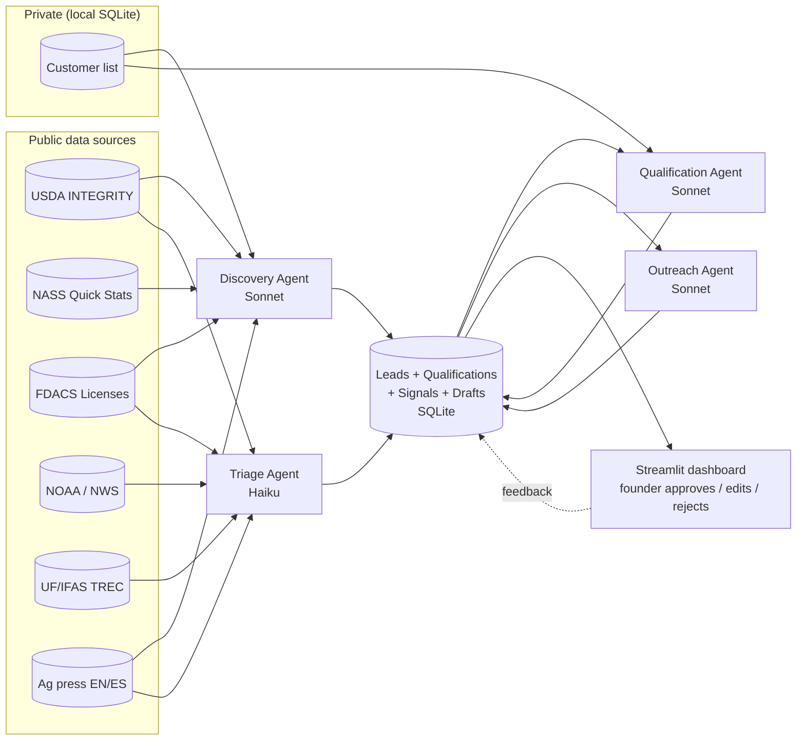

# Architecture

This expands the README's ASCII diagram with the actual data flow, agent
contracts, and where state lives.

## Agent topology

## Why these four agents

The split is along *what changes the answer*, not what looks tidy on a
diagram. Each agent has its own:

- input/output contract (Pydantic schema)
- system prompt (markdown, versioned)
- eval set (JSONL of cases with founder-labeled ground truth)
- failure modes that an analyst can debug independently

Mixing these would make recall measurements impossible. We can't tell whether
a missed lead was a Discovery miss or a Qualification miss if the same agent
does both.

| Agent | Runs on | Input | Output | Failure mode we care about |
|---|---|---|---|---|
| Discovery | Sonnet | scope (ZIPs) + customer list | `list[Lead]` | misses operations that exist in INTEGRITY/FDACS |
| Qualification | Sonnet | one Lead | one Qualification | mistier (T1 → T3 or vice versa) |
| Triage | Haiku | one feed item | `list[Signal]` (often empty) | false positive (waste founder's time) |
| Outreach | Sonnet | Lead + Qualification + Signal | one OutreachDraft | generic message that doesn't earn the open |

Triage runs on Haiku because it's high-volume and the per-item stakes are
low. Everything else runs on Sonnet.

## Data flow on a fresh ZIP scan

1. **Discovery** pulls bulk snapshots, merges, dedupes, and emits Leads. Each
   Lead carries one or more `Evidence` objects. Existing customers and
   previously-contacted operations are tagged but not filtered out at this stage
   — they're filtered at the outreach stage so the Coverage Map can render them.
2. **Qualification** consumes one Lead at a time, attaches a Qualification with
   tier + score + sub-scores + rationale + evidence pointers.
3. **Triage** runs on a separate cadence (every few hours for weather, daily
   for press, weekly for INTEGRITY diffs). Emits Signals attached to known
   Leads when possible.
4. **Outreach** is invoked only when (a) a Qualification is T1/T2/T3, AND
   (b) there's either a fresh Signal or a customer-list cross-reference to
   anchor first-touch. Otherwise it refuses.
5. The **Streamlit dashboard** reads from the SQLite store and shows the
   founder a ranked queue. The founder approves / edits / rejects each draft.
   Edits are diffed against the original draft — that diff becomes a
   prompt-iteration signal in `docs/prompt-iteration.md`.

## State

All state is local SQLite at `${INTERCELEX_DB_PATH}` (default
`./data/intercelex.db`). Tables, roughly:

| Table | Notes |
|---|---|
| `leads` | one row per Lead. JSON column for `sources`/Evidence. |
| `qualifications` | one row per (lead_id, prompt_version). Latest wins by `qualified_at`. |
| `signals` | one row per Signal. FK to leads when resolved. |
| `outreach_drafts` | one row per (lead_id, prompt_version). Status: draft / approved / sent / rejected. |
| `customers` | private. Schema documented in `tools/customer_db.py`. |
| `eval_runs` | one row per `run_evals.py` invocation, with metrics blob. |

Why SQLite, not Postgres: single operator, single laptop, no concurrent
writers, sensitive data must not leave disk. SQLite is the lowest-risk
default. Migrate if and when this stops fitting.

## What's deliberately *not* here yet

- **Authentication / multi-tenant.** Single operator. Not needed.
- **Async tool fan-out / orchestration framework.** The agents are
  independent functions; the orchestrator is a script. Adopt LangGraph or the
  Agent SDK's subagent pattern only if scaling out.
- **Embeddings / RAG.** The corpus is small enough (hundreds of operations,
  not millions of documents) that direct context-window usage works.
  Add embeddings if Discovery needs to disambiguate noisy press mentions and
  the heuristic dedupe is insufficient.
- **A second customer's data.** Designed to extend, not designed for it
  prematurely.

## Extension path

Same architecture, more ZIP codes:

- Broward, Palm Beach: drop in new ZIP scope, retrain qualification rubric
  on whatever new tier/crop signal the founder gives.
- GA / SC / AL: new state-level FDACS analogs — each gets its own adapter
  under `src/tools/`. NOAA is national; INTEGRITY is national. Press feeds
  need outlet-list updates per state.

The four-agent shape doesn't change.
